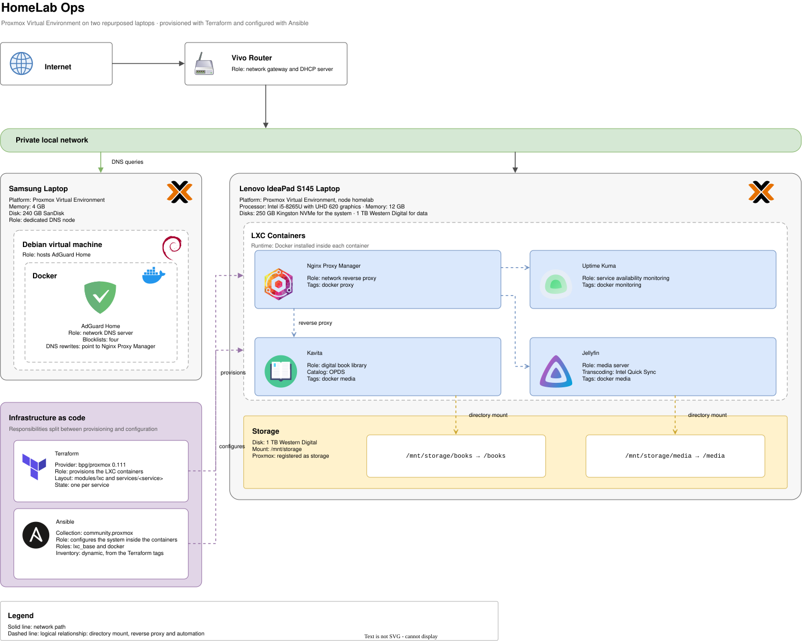

> [!WARNING]
> This repository is **documentation only**. It holds no infrastructure code, no
> configuration, no inventories and no credentials, and there is nothing here to clone and
> run. The **Terraform** and **Ansible** that build and configure this environment live in a
> separate **private repository**.
>
> What is published here is the **architecture**, written so it can be read by someone who
> will never have access to the environment. Values that would be needed to operate it are
> **deliberately absent**.

### HomeLab Documentation

<p align="justify">
    
    
    
    
    
</p>



## What this repository is

This repository is the public documentation of a personal home lab built on **Proxmox
Virtual Environment**. It holds the **architecture diagram** and the written explanation of how
the environment is put together: which machines exist, which services run on them, how
they are connected, and which tool is responsible for each layer.

## Why it exists

A home lab is easy to describe in a sentence and hard to hand to someone else. The
configuration is spread across a **hypervisor**, a set of **containers**, a **DNS server**, a **reverse
proxy** and two **automation tools**, and none of that is visible from the outside.

This repository answers three questions without giving access to the environment itself:

- **What is running**, and on which machine.
- **How a request reaches a service**, from the router down to the container.
- **Which tool owns which responsibility**, and where the boundary between them sits.

The separation is deliberate. The operational repository holds **state files**, **inventories**
and **host-specific values**, and is not meant to be published. The architecture is, so it
lives here on its own.


The diagram is the **reference artifact** of this repository. The text below describes the
same environment in prose and uses the same terminology, so a name that appears in one
appears in the other.

## The environment

### Network

A single **private local network** sits behind the **ISP router**, which acts as the network
gateway and `DHCP` server. Everything in the lab is on that network. **Nothing is exposed to
the internet.**

Two repurposed laptops run **Proxmox Virtual Environment**. They are **not a cluster**: each one
is an **independent node** with a distinct role.

### DNS node

A **Samsung** laptop with `4 GB` of memory and a `240 GB` SanDisk disk is dedicated to **DNS** and
runs nothing else.

Inside it, a **Debian** virtual machine hosts **AdGuard Home** in a **Docker** container. AdGuard
Home is the DNS server for the whole network: it resolves every query, applies **four
blocklists**, and holds the **DNS rewrites** that point local names to the **reverse proxy**.

The layering is worth reading literally in the diagram: a **physical laptop**, running a
**hypervisor**, running a **virtual machine**, running **Docker**, running **one service**. The only
reason this node exists separately is so that **DNS does not depend on the machine that
hosts everything else**.

### Main node

A **Lenovo IdeaPad S145** is the **main node**, registered in Proxmox as `homelab`. It has an
`Intel i5-8265U` with `UHD 620` graphics, `12 GB` of memory, a `250 GB` Kingston NVMe for the
**system**, and a `1 TB` Western Digital disk for **data**.

Every service other than DNS runs here, inside **LXC containers**. Each container has **Docker**
installed, so the pattern is **one container per service**, with the service itself running as
a container inside it.

### Services

| Service | Role | Notes |
----------|------|-------|
| **Nginx Proxy Manager** | Network reverse proxy | **Entry point** for the other services. The DNS rewrites in **AdGuard Home** point here. |
| **Uptime Kuma** | Service availability monitoring | Watches the other services. |
| **Kavita** | Digital book library | Exposes an `OPDS` catalog, so external readers can browse the library. |
| **Jellyfin** | Media server | Transcodes using **Intel Quick Sync**, provided by the `UHD 620` graphics. |

Every container carries **Terraform tags** that describe what it is: `docker` on all of them,
plus `proxy`, `monitoring` or `media` depending on the service. Those tags are not
decoration, they are **the mechanism that connects the two automation tools**. See
*Infrastructure as code* below.

### Storage

The `1 TB` Western Digital disk is mounted at `/mnt/storage` and registered in Proxmox as a
storage named `storage`.

Two directories on that disk are **bind mounted** into the containers that need them:

```text
/mnt/storage/books  →  /books    (Kavita)
/mnt/storage/media  →  /media    (Jellyfin)
```

The **data lives on the host**, not inside the containers. A container can be **destroyed and
recreated** without touching the library.

### How a request flows

1. A device asks **AdGuard Home** to resolve a local name.
2. AdGuard Home answers from its **DNS rewrites**, which point to **Nginx Proxy Manager**.
3. The device reaches Nginx Proxy Manager, which **proxies the request** to the container
   running the service.
4. The service reads its data from the directory **bind mounted** from `/mnt/storage`.

In the diagram, a **solid line** is a **network path** and a **dashed line** is a **logical
relationship**, such as a directory mount, a reverse proxy route, or an automation step.

## Infrastructure as code

The environment is **not configured by hand**. Two tools build it, with the responsibilities
split along a clear line: **Terraform provisions, Ansible configures.**

### Terraform

**Terraform** creates the **LXC containers** on Proxmox, using the `bpg/proxmox` provider. Its
layout has two levels:

- `modules/lxc` is a single **reusable module** that describes what a container is.
- `services/<service>` is **one root module per service**, composing that module with the
  values of that service.

Each service keeps **its own state**. A service can be **planned, applied or destroyed on its
own**, without touching the others. That is the reason for the **per-service split** rather than
one root module iterating over a list.

### Ansible

**Ansible** configures the system inside the containers, using the `community.proxmox`
collection. It has two roles:

- `lxc_base` prepares the **operating system**.
- `docker` installs and configures the **container runtime**.

### The handoff

The two tools are **not chained by a generated file**. Terraform applies **tags** to each
container, and Ansible reads those tags from the **Proxmox API** as a **dynamic inventory**. A
container tagged `docker` lands in the group that receives the `docker` role, and the
grouping follows from the provisioning itself.

This is why the tags appear on every service in the diagram: they are **the contract between
the two halves of the automation**.

## Relationship with the private repository

| | This repository | Private repository |
|-|-----------------|--------------------|
| **Visibility** | Public | Private |
| **Contains** | Architecture diagram and documentation | Terraform and Ansible code |
| **Purpose** | Explain the environment | Build and configure the environment |

Both describe the same lab. This one is written so it can be read by someone who will
never have access to the environment, so it carries **no addresses, no identifiers and no
configuration values**. The private repository is the **operational source of truth**.

When the architecture changes, **both change**: the code in the private repository and the
diagram here.

